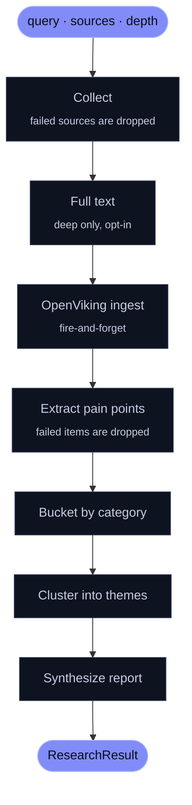
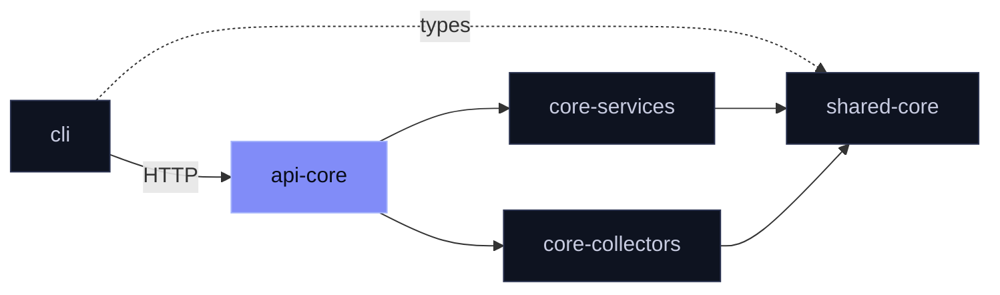

<div align="center">

# `@mira/api-core`

**Query in. Themes out.**

A minimal Hono server with an in-process worker that runs Mira's research pipeline.

[](https://www.npmjs.com/package/@mira/api-core)
[](./LICENSE)

</div>

<br>

Submit a research query. The server queues it, collects discussion from Reddit, Hacker News and RSS, extracts pain points with an LLM, clusters them into themes and writes a summary. Read the result back over HTTP.

## Run it

**You need** Redis · an LLM API key · your own prompts directory. Postgres only for `migrate`.

```sh
pnpm install && pnpm build
pnpm --filter @mira/api-core migrate
pnpm --filter @mira/api-core start
```

> [!IMPORTANT]
> No prompt files ship in any public Mira repository. Set `MIRA_PROMPTS_DIR` to a directory with `extract_pain_points.txt` and `synthesize_report.txt` before starting.

> [!CAUTION]
> No authentication, no rate limiting. Put it behind your own gateway if anyone you don't trust can reach it.

## Ask

```sh
curl -X POST localhost:3000/api/v1/research \
  -H 'content-type: application/json' \
  -d '{"query":"invoicing software","depth":"quick"}'
# → 202 { "jobId": "1", "status": "queued" }

curl localhost:3000/api/v1/research/1
```

| Route | Does |
|:--|:--|
| `POST /api/v1/research` | Queue a job — `{ query, sources?, depth? }` → `202` |
| `GET /api/v1/research/:jobId` | Read a job and its result |
| `GET /api/v1/research` | List jobs |
| `GET /health` | Liveness |

`400` for a bad body · `404` for an unknown job · `503` when the queue is down.

## What happens to your query



Results land in three buckets: **pain points**, **competitor weaknesses** and **emerging gaps**. A failing source never fails the job; a failing report does, and the job is retried.

## Two depths

| | `quick` | `deep` |
|:--|:--|:--|
| Volume | Smaller, lower spend cap | Larger, higher spend cap |
| Clustering | String dedup, no embeddings | Jina embeddings |
| Full text | — | Opt-in with `MIRA_ENABLE_FULLTEXT=true` |

## Where it sits



<details>
<summary><b>Configuration</b></summary>

<br>

| Variable | For |
|:--|:--|
| `LLM_API_KEY` · `LLM_BASE_URL` · `LLM_MODEL` | Any OpenAI-compatible endpoint |
| `LLM_DISABLE_THINKING` | Force thinking mode on or off |
| `REDIS_URL` | Job queue |
| `DATABASE_URL` | `migrate` |
| `PORT` · `CORS_ORIGIN` | HTTP server |
| `APIFY_API_TOKEN` | The `reddit` source |
| `JINA_API_KEY` | Deep-mode clustering, optional full text |
| `MIRA_ENABLE_FULLTEXT` · `MIA_ENABLE_FULLTEXT` | Pipeline full text · collector RSS full text |
| `MIRA_FULLTEXT_CONCURRENCY` · `MIRA_EXTRACTION_CONCURRENCY` · `MIRA_OPENVIKING_INGEST_CONCURRENCY` | Throughput |
| `OPENVIKING_URL` · `OPENVIKING_API_KEY` | Memory store |
| `MIRA_PROMPTS_DIR` | Your prompt files |
| `MIRA_DEBUG_LOGGING` | Debug logs |

</details>

<details>
<summary><b>Workspace layout</b></summary>

<br>

No public self-host bundle exists yet. Build in a pnpm workspace with `shared`, `core-services` and `core-collectors` cloned next to this repository.

</details>

<br>

<div align="center">
<sub>
Part of <a href="https://github.com/mira-js">Mira's open core</a> ·
<a href="./LICENSE">AGPL-3.0-only</a> ·
<a href="https://github.com/mira-js/.github/blob/main/CONTRIBUTING.md">Contributing</a> (<a href="https://github.com/mira-js/.github/blob/main/CLA.md">CLA</a>) ·
<a href="https://github.com/mira-js/api/security/advisories/new">Report a vulnerability</a>
<br>
Copyright (C) 2026 Fernando Nieto Pallares
</sub>
</div>
